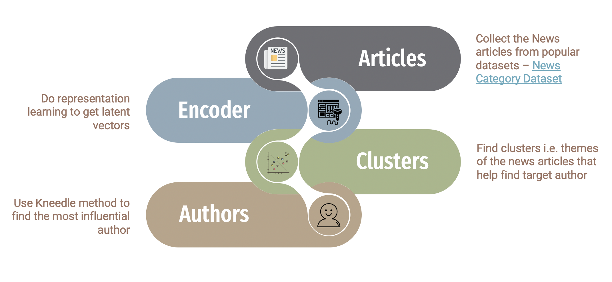

# Discovering Super-Influencers of Media through Representation Learning
Predict when a **topic or theme** will grow in importance to inform which **journalistic sources tend to be super infectors/influencers** for narratives that get picked by major news sources.

# Architecture Pipeline

# Approach

